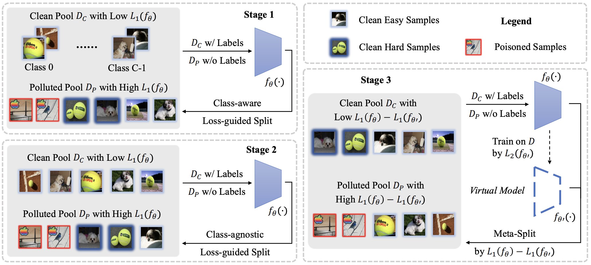

# Backdoor Defense via Adaptively Splitting Poisoned Dataset

This repository provides the pytorch implementatin of our CVPR 2023 work: [Backdoor Defense via Adaptively Splitting Poisoned Dataset](https://arxiv.org/abs/2303.12993).

## Abstract

Backdoor defenses have been studied to alleviate the threat of deep neural networks (DNNs) being backdoor attacked and thus maliciously altered. Since DNNs usually adopt some external training data from an untrusted third party, a robust backdoor defense strategy during the training stage is of importance. We argue that the core of training-time defense is to select poisoned samples and to handle them properly. 
In this work, we summarize the training-time defenses from a unified framework as splitting the poisoned dataset into two data pools. Under our framework, we propose an adaptively splitting dataset-based defense (ASD). Concretely, we apply loss-guided split and meta-learning-inspired split to dynamically update two data pools. With the split clean data pool and polluted data pool, ASD successfully defends against backdoor attacks during training. Extensive experiments on multiple benchmark datasets and DNN models against six state-of-the-art backdoor attacks demonstrate the superiority of our ASD.

<div align=center>
<br/>
</div>

## Installation

This code is tested on our local environment (python=3.7, cuda=11.1), and we recommend you to use anaconda to create a vitural environment:

```bash
conda create -n ASD python=3.7
```
Then, activate the environment:
```bash
conda activate ASD
```

Install PyTorch:

```bash
pip install torch==1.8.0+cu111 torchvision==0.9.0+cu111 torchaudio==0.8.0 -f https://download.pytorch.org/whl/torch_stable.html
```
and other  requirements:
```bash
pip install -r requirements.txt
```

## Data Preparation

Please download CIFAR-10 dataset from its [official
website](https://www.cs.toronto.edu/~kriz/cifar-10-python.tar.gz) and extract it to `dataset_dir`
specified in the [YAML configuration file](./config/baseline_asd.yaml).

## Backdoor Defense

Run the following command to train our ASD under BadNets attack.

```shell
python ASD.py --config config/baseline_asd.yaml --resume False --gpu 0
```

We provide pretrained models [here](./storage/baseline_asd/checkpoint).

Run the following command to test our ASD under BadNets attack.

```shell
python test.py --config config/baseline_asd.yaml --resume latest_model.pt --gpu 0
```

## Citation

```
@inproceedings{gao2023backdoor,
  title={Backdoor Defense via Adaptively Splitting Poisoned Dataset},
  author={Gao, Kuofeng and Bai, Yang and Gu, Jindong and Yang, Yong and Xia, Shu-Tao},
  booktitle={CVPR},
  year={2023}
}
```

## Acknowledgements

This respository is mainly based on [DBD](https://github.com/SCLBD/DBD), and it also benefits from [BackdoorBox](https://github.com/THUYimingLi/BackdoorBox). Thanks for their wonderful works!
